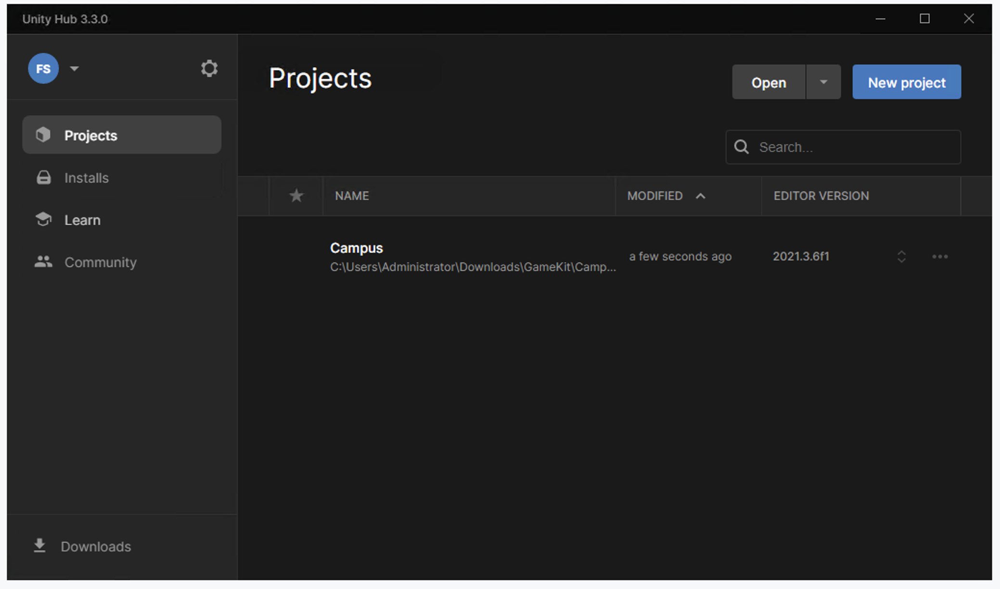
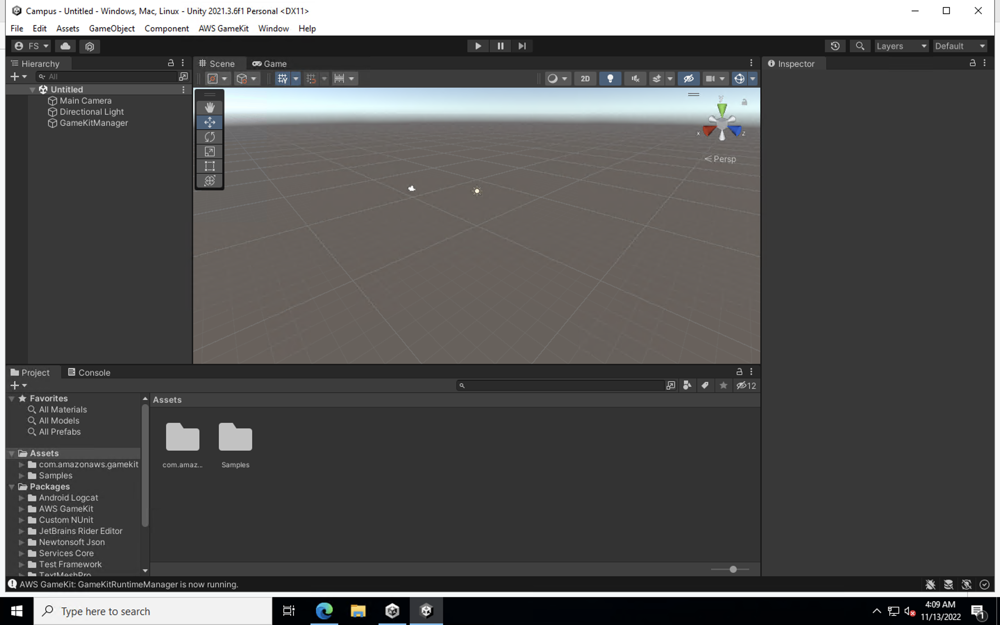

# Workshop - AWS GameKit

Bem-vindo à Campus Party Brasil 2022!

Ficamos felizes que você tenha dedicado parte do seu dia para exercitar alguns conceitos e experimentar, na prática, um pouco da experiência de um desenvolvedor de jogos eletrônicos.

Neste workshop cada participante (com qualquer nível de conhecimento) terá a oportunidade de criar um mini-jogo. Os participantes conhecerão o AWS GameKit, solução que permite a desenvolvedores implantar e personalizar recursos de backend de jogos diretamente a partir dos engines Unity e Unreal, e experimentarão na prática com projetos-exemplo.

Onde consigo materiais adicionais para me ajudar?

Você pode encontrar o descritivo e a documentação do serviço AWS GameKit nestes dois links:

[Descritivo do serviço](https://aws.amazon.com/pt/gamekit/)

[Documentação do serviço](https://docs.aws.amazon.com/gamekit/index.html)

Além disso, recomendamos que siga este guia inicial em caso de dúvidas, pois passa por cada um dos primeiros passos para se usar o GameKit através da console: 

[Getting started - Unity](https://docs.aws.amazon.com/gamekit/latest/UnityDevGuide/getting-started.html)

[Getting started - Unreal](https://docs.aws.amazon.com/gamekit/latest/UnrealDevGuide/getting-started.html)

Este workshop foi construído para que você não precise da documentação extra, mas é sempre bom saber onde encontrar ajuda se quiser se aprofundar! Seguindo o passo a passo, você vai poder entender um pouco melhor qual o papel de um game engine, Unity no neste caso, navegar um pouco na console de serviços da AWS, e como o AWS GameKit automatiza tarefas de construção da infraestrutura de backend para suportar seu jogo online.

## Pré-requisitos

### Usuário e conta da AWS

Para execução deste workshop você precisará de um usuário aa AWS com acesso aos serviços IAM, S3, DynamoDB, Lambda, API Gateway, Parameter Store, EC2, Cognito e CloudFormation. Se você estiver realizando este workshop dentro da sessão da Campus Play, a equipe vai fornecer uma conta e usuário temporários da AWS, mas se você não conseguiu participar e está tentando os passos em outro momento, sem problemas, basta acessar o site da AWS, criar sua conta, depois você pode voltar aqui e continuar a partir do passo de criação de um usuário ("III. Criando um usuário com acesso ao AWS GameKit").

## I. Acessando a console da AWS pela primeira vez

A equipe do workshop vai passar detalhes aos participantes.

## II. Criando uma estação de trabalho na nuvem

Com o objetivo de ganhar tempo, vamos criar uma estação de trabalho na nuvem e fazer todo o desenvolvimento lá. Esta é uma boa maneira de garantir que você sempre tenha acesso à sua máquina, não importa onde estiver. Caso esteja fazendo este workshop fora da Campus Play e queira reproduzir este trecho no seu próprio computador, sem a necessidade de criar a estação de trabalho na AWS, basta fazer o download do Unity e instalar, você pode encontrar os links mais importantes no final desta seção.

### Executando uma instância no Amazon EC2

1. Na Console de Gerenciamento da AWS, acesse o serviço EC2, você pode buscá-lo na barra de buscas ou acessar diretamente por este [link](https://console.aws.amazon.com/ec2/).

2. Assegure-se de que você esteja utilizando a Região Ohio (us-east-2), para isso, observe no canto superior direito da tela com um nome de cidade e uma seta apontando para baixo. Se estiver Ohio, tudo certo, mas se estiver Oregon, N. Virginia, São Paulo, ou qualquer outro nome, clique na seta e selecione `Leste dos EUA (Ohio) us-east-2`. A AWS possui seus serviços distribuídos ao redor do mundo em Regiões. Este workshop foi construído para usar a Região de Ohio como exemplo, mas se você estiver repetindo ou se aprofundando, saiba que você poderia usar outras Regiões, desde que suportadas pelo AWS GameKit.

3. Na console do EC2, entre em `Instâncias > Instâncias`, depois clique no botão `Executar instâncias`.

4. Neste passo, você vai preencher todos os detalhes da estação de trabalho que irá criar. Em `Nomes e Tags`, dê o nome `Unity Workstation` à sua instância.

5. Em `Imagens de aplicação e de sistema operacional (imagem de máquina da Amazon)`, selecione a aba `Minhas AMIs` e depois `De minha propriedade`. Uma opção chamada `Unity3D Template` aparecerá.

6. Em `Tipo de instância`, selecione a opção `t2.xlarge`.

7. Em `Par de chaves (login)`, clique no link `Criar novo par de chaves`, uma janela pop-up surgirá, dê o nome `unity-keys` ao par de chaves e selecione a opção `.pem`. Faça download do arquivo `unity-keys.cer`.

8. Em `Configurações de rede`, mantenha selecionadas as opções `Criar grupo de segurança` e `Permitir tráfego RDP de`. Deve haver um quadro ao lado desta última opção, nele deveria estar escrito `Qualquer lugar 0.0.0.0/0`.

9. Em `Configurar armazenamento`, certifique-se de que as opções do Volume Raiz estejam como 1x `100` GiB `gp3`.

10. Depois de alterar e conferir as configurações anteriores, clique no botão `Executar instância`. Sua estação de trabalho será criada a partir de uma AMI - Amazon Machine Image previamente construída para o workshop. Esta AMI possui o sistema operacional Windows e já traz pré-instalados alguns softwares, como o navegador Firefox e a engine Unity.

Caso queria reproduzir a estação de trabalho no seu próprio computador, basta fazer o download do Unity Hub [aqui](https://unity3d.com/pt/get-unity/download) e dos arquivos do AWS GameKit [aqui](https://github.com/aws/aws-gamekit-unity/releases).

11. Aguarde alguns minutos para que sua instância seja criada e depois inicializada com sucesso. Se quiser, pode avançar para o próximo passo do workshop e voltamos aqui na sequência.

#### O que foi feito até este ponto?

Você criou uma estação de trabalho Windows Server a partir de uma imagem previamente gerada pela equipe da AWS para este workshop. Durante a configuração, você gerou uma chave criptográfica para acesso seguro à instância, definiu qual o tamanho da máquina virtual, qual o tamanho do volume de disco, e algumas regras similares a um firewall local para acesso remoto via RDP - Remote Desktop.

## III. Criando um usuário com acesso ao AWS GameKit

É uma boa prática ter diferentes usuários e perfis com acesso restrito aos recursos da sua conta na AWS. Desta maneira, aumenta-se o nível de segurança, estabelecendo um controle mais granular de "quem pode fazer o que". O AWS GameKit provê um script automarizado para criação de usuários, mas para exercitarmos um pouco deste processo, vamos executar o passo a passo manualmente.

### Usando o IAM para configuração do usuário de acesso

#### Criar uma política de permissões para o AWS GameKit:

1. Acesse a Console de Gerenciamento da AWS e procure pelo serviço IAM, ou acesse diretamente o [link](https://console.aws.amazon.com/iam/).

2. Na console do IAM, entre em `Gerenciamento de acesso` > `Políticas` para criar políticas de permissionamento do AWS GameKit para sua conta da AWS. Clique no botão `Criar política`.

3. Selecione a aba `JSON` para abrir o editor de JSON, depois substitua o conteúdo existente com a sintaxe de permissões para usuários do AWS GameKit. Para isso, use o exemplo a seguir, copie deste roteiro e cole na caixa correspondente dentro da console do IAM:

```JSON
    {
    "Version": "2012-10-17",
    "Statement": [
        {
            "Effect": "Allow",
            "Action": [
                "kms:Create*",
                "kms:Describe*",
                "kms:Enable*",
                "kms:List*",
                "kms:Put*",
                "kms:Update*",
                "kms:Revoke*",
                "kms:Disable*",
                "kms:Get*",
                "kms:Delete*",
                "kms:TagResource",
                "kms:UntagResource",
                "kms:ScheduleKeyDeletion",
                "kms:CancelKeyDeletion"
            ],
            "Resource": "*"
        },
        {
            "Effect": "Allow",
            "Action": [
                "apigateway:UpdateRestApiPolicy",
                "apigateway:POST",
                "apigateway:GET",
                "apigateway:PUT",
                "apigateway:DELETE",
                "apigateway:PATCH"
            ],
            "Resource": "*"
        },
        {
            "Effect": "Allow",
            "Action": [
                "lambda:UpdateFunctionCode",
                "lambda:AddPermission",
                "lambda:GetFunction",
                "lambda:RemovePermission",
                "lambda:UpdateFunctionConfiguration",
                "lambda:InvokeFunction"
            ],
            "Resource": "arn:aws:lambda:*:<YOUR_ACCOUNT_ID>:function:*"
        },
        {
            "Effect": "Allow",
            "Action": [
                "ssm:PutParameter",
                "ssm:RemoveTagsFromResource",
                "ssm:AddTagsToResource",
                "ssm:GetParameters",
                "ssm:GetParameter",
                "ssm:DeleteParameter"
            ],
            "Resource": "arn:aws:ssm:*:<YOUR_ACCOUNT_ID>:parameter/*"
        },
        {
            "Effect": "Allow",
            "Action": [
                "ssm:DescribeParameters"
            ],
            "Resource": "arn:aws:ssm:*:<YOUR_ACCOUNT_ID>:*"
        },
        {
            "Effect": "Allow",
            "Action": [
                "iam:ListRoles",
                "iam:ListOpenIdConnectProviders",
                "iam:GetRole",
                "iam:CreateRole",
                "iam:DeleteRole",
                "iam:GetRolePolicy",
                "iam:PutRolePolicy",
                "iam:DeleteRolePolicy",
                "iam:DetachRolePolicy",
                "iam:ListSAMLProviders",
                "iam:GetSAMLProvider"
            ],
            "Resource": "*"
        },
        {
            "Effect": "Allow",
            "Action": [
                "iam:CreateServiceLinkedRole"
            ],
            "Resource": "*",
            "Condition": {
                "StringEquals": {
                    "iam:AWSServiceName": [
                        "replication.dynamodb.amazonaws.com",
                        "dax.amazonaws.com",
                        "dynamodb.application-autoscaling.amazonaws.com",
                        "contributorinsights.dynamodb.amazonaws.com",
                        "kinesisreplication.dynamodb.amazonaws.com",
                        "cognito-idp.amazonaws.com",
                        "cognito-identity.amazonaws.com",
                        "email.cognito-idp.amazonaws.com"
                    ]
                }
            }
        },
        {
            "Effect": "Allow",
            "Action": [
                "iam:DeleteServiceLinkedRole",
                "iam:GetServiceLinkedRoleDeletionStatus"
            ],
            "Resource": [
                "arn:aws:iam::*:role/aws-service-role/cognito-idp.amazonaws.com/AWSServiceRoleForAmazonCognitoIdp*",
                "arn:aws:iam::*:role/aws-service-role/email.cognito-idp.amazonaws.com/AWSServiceRoleForAmazonCognitoIdpEmail*"
            ]
        },
        {
            "Action": [
                "iam:PassRole",
                "iam:AttachRolePolicy"
            ],
            "Effect": "Allow",
            "Resource": [
                "arn:aws:iam::<YOUR_ACCOUNT_ID>:role/gamekit*",
                "arn:aws:iam::<YOUR_ACCOUNT_ID>:role/service-role/gamekit*"
            ]
        },
        {
            "Effect": "Allow",
            "Action": [
                "cognito-identity:*",
                "cognito-idp:*",
                "cognito-sync:*"
            ],
            "Resource": "*"
        },
        {
            "Effect": "Allow",
            "Action": [
                "ses:ListIdentities",
                "ses:GetIdentityVerificationAttributes"
            ],
            "Resource": "*"
        },
        {
            "Effect": "Allow",
            "Action": [
                "mobiletargeting:GetApps"
            ],
            "Resource": "*"
        },
        {
            "Effect": "Allow",
            "Action": [
                "acm:ListCertificates"
            ],
            "Resource": "*"
        },
        {
            "Effect": "Allow",
            "Action": [
                "cloudformation:*"
            ],
            "Resource": "*"
        },
        {
            "Effect": "Allow",
            "Action": [
                "dynamodb:*",
                "dax:*"
            ],
            "Resource": "*"
        },
        {
            "Effect": "Allow",
            "Action": [
                "application-autoscaling:DeleteScalingPolicy",
                "application-autoscaling:DeregisterScalableTarget",
                "application-autoscaling:DescribeScalableTargets",
                "application-autoscaling:DescribeScalingActivities",
                "application-autoscaling:DescribeScalingPolicies",
                "application-autoscaling:PutScalingPolicy",
                "application-autoscaling:RegisterScalableTarget"
            ],
            "Resource": "*"
        },
        {
            "Effect": "Allow",
            "Action": [
                "cloudwatch:DeleteAlarms",
                "cloudwatch:DescribeAlarmHistory",
                "cloudwatch:DescribeAlarms",
                "cloudwatch:DescribeAlarmsForMetric",
                "cloudwatch:GetMetricStatistics",
                "cloudwatch:ListMetrics",
                "cloudwatch:PutMetricAlarm",
                "cloudwatch:GetMetricData",
                "cloudwatch:GetDashboard",
                "cloudwatch:PutDashboard",
                "cloudwatch:DeleteDashboards",
                "logs:CreateLogGroup",
                "logs:DeleteLogGroup",
                "logs:PutRetentionPolicy",
                "logs:DeleteRetentionPolicy",
                "events:DescribeRule",
                "events:PutRule",
                "events:PutTargets",
                "events:DeleteRule",
                "events:EnableRule",
                "events:DisableRule",
                "events:RemoveTargets"
            ],
            "Resource": "*"
        },
        {
            "Effect": "Allow",
            "Action": [
                "datapipeline:ActivatePipeline",
                "datapipeline:CreatePipeline",
                "datapipeline:DeletePipeline",
                "datapipeline:DescribeObjects",
                "datapipeline:DescribePipelines",
                "datapipeline:GetPipelineDefinition",
                "datapipeline:ListPipelines",
                "datapipeline:PutPipelineDefinition",
                "datapipeline:QueryObjects"
            ],
            "Resource": "*"
        },
        {
            "Effect": "Allow",
            "Action": [
                "kms:DescribeKey",
                "kms:ListAliases"
            ],
            "Resource": "*"
        },
        {
            "Effect": "Allow",
            "Action": [
                "sns:CreateTopic",
                "sns:DeleteTopic",
                "sns:ListSubscriptions",
                "sns:ListSubscriptionsByTopic",
                "sns:ListTopics",
                "sns:Subscribe",
                "sns:Unsubscribe",
                "sns:SetTopicAttributes",
                "sns:ListPlatformApplications"
            ],
            "Resource": "*"
        },
        {
            "Effect": "Allow",
            "Action": [
                "lambda:GetPolicy",
                "lambda:CreateFunction",
                "lambda:ListFunctions",
                "lambda:ListEventSourceMappings",
                "lambda:CreateEventSourceMapping",
                "lambda:DeleteEventSourceMapping",
                "lambda:GetFunctionConfiguration",
                "lambda:DeleteFunction",
                "lambda:PublishLayerVersion",
                "lambda:DeleteLayerVersion",
                "lambda:GetLayerVersion",
                "lambda:PutFunctionConcurrency"
            ],
            "Resource": "*"
        },
        {
            "Effect": "Allow",
            "Action": [
                "kinesis:ListStreams",
                "kinesis:DescribeStream",
                "kinesis:DescribeStreamSummary"
            ],
            "Resource": "*"
        },
        {
            "Action": "cloudwatch:GetInsightRuleReport",
            "Effect": "Allow",
            "Resource": "arn:aws:cloudwatch:*:*:insight-rule/DynamoDBContributorInsights*"
        },
        {
            "Effect": "Allow",
            "Action": "s3:*",
            "Resource": "*"
        },
        {
            "Effect": "Allow",
            "Action": [
                "secretsmanager:DescribeSecret",
                "secretsmanager:PutSecretValue",
                "secretsmanager:CreateSecret",
                "secretsmanager:DeleteSecret",
                "secretsmanager:UpdateSecret",
                "secretsmanager:GetSecretValue"
            ],
            "Resource": "arn:aws:secretsmanager:*:<YOUR_ACCOUNT_ID>:secret:*"
        },
        {
            "Effect": "Allow",
            "Action": [
                "secretsmanager:ListSecrets"
            ],
            "Resource": "*"
        },
        {
            "Effect": "Allow",
            "Action": [
                "cloudfront:CreateCloudFrontOriginAccessIdentity",
                "cloudfront:DeleteCloudFrontOriginAccessIdentity",
                "cloudfront:ListCloudFrontOriginAccessIdentities",
                "cloudfront:GetCloudFrontOriginAccessIdentity",
                "cloudfront:CreateDistribution",
                "cloudfront:DeleteDistribution",
                "cloudfront:GetDistribution",
                "cloudfront:GetDistributionConfig",
                "cloudfront:ListDistributions",
                "cloudfront:UpdateDistribution",
                "cloudfront:TagResource"
            ],
            "Resource": "*"
        },
        {
            "Effect": "Allow",
            "Action": "sts:AssumeRole",
            "Resource": "arn:aws:iam::<YOUR_ACCOUNT_ID>:role/gamekit_dev_*_AchievementsAdminInvokeRole"
        }
    ]
}
```

Personalize o conteúdo para sua conta, para isso, substitua as strings `<YOUR_ACCOUNT_ID>` pelo seu AWS account ID (número de conta de 9 dígitos). Para encontrar seu AWS account ID, clique no nome de usuário que aparece no topo ao lado direito, uma lista se expandirá contendo, entre outras informações, o número de 9 dígitos. Copie este número e substitua todas as ocorrências da string `<YOUR_ACCOUNT_ID>` por ele.
Dica: há um pequeno ícone com dois pequenos quadrados ao lado direito do número de conta, clique nele para copiar o conteúdo. Em alguns momentos do workshop este ícone estará disponível e ajuda bastante a garantir que nenhum caractere se perca ;)

4. Na console do IAM, após ter editado a sintaxe da política, vá clicando em `Próximo` até que a página de revisão da política apareça. Use o nome `GameKitDeveloperPolicy` para nomeá-la, e depois clique em `Criar política`.

#### Configurar um usuário com acesso ao AWS GameKit

1. Na console do IAM, entre em `Gerenciamento de acesso` > `Usuários`, depois clique em `Adicionar usuários` para criar um novo usuário, entre com o nome de usuário `unity-user`.

2. Em `Selecione o tipo de acesso à AWS`, marque ambos os tipos de credenciais. A opção `Chave de acesso - acesso programático` gera credenciais de segurança necessárias a usuários do AWS GameKit. A opção `Senha` permite a usuários acessar e usar a Console de Gerenciamento da AWS. Deixe marcada a opção `Senha gerada automaticamente` e desmarque a opção `O usuário deve criar uma nova senha no próximo login`.

3. Na página de permissões, selecione a opção `Anexar políticas existentes de forma direta`. Localize a política `GameKitDeveloperPolicy` e selecione-a.

Continue seguindo o passo a passo para criar o usuário. Finalizado o processo, a console do IAM mostrará as credenciais de segurança do uruário. Faça o download destes dados para um arquivo `.csv` local, uma vez que não há outra maneira de recuperar algumas destas informações a partir deste ponto. Se você perder estas credenciais, terá que gerar novas credenciais. Para o workshop isso não é um problema, podemos gerar novas credenciais e repetir alguns passos, mas em ambientes produtivos estas informações são extremamente sensíveis e por isso é necessário ter um cuidado extra no armazenamento e manuseio destas credenciais.

#### O que foi feito até este ponto?

Você criou uma política contendo as permissões necessárias para o funcionamento do AWS GameKit. Ela restringe o acesso de usuários a fazerem apenas o que é necessário ao funcionamento adequado do GameKit. Na sequência você criou um usuário que pode acessar os serviços da AWS de duas maneiras, pela console, como você está fazendo, ou programaticamente (via código), através das chaves geradas. Na criação, seu usuário não tinha qualquer permissão, mas ao anexar a política criada para o GameKit, você então estabeleceu que as permissões dele são governadas por aquela política.

## IV. Acessando a estação de trabalho na nuvem

Sua instância já deve estar pronta, agora vamos acessá-la e continuar o workshop a partir dela.

1. Na Console de Gerenciamento da AWS, procure e acesse o serviço EC2.

2. Entre em `Instâncias` > `Instâncias`, selecione a instância `Unity Workstation` foi criada e clique no botão `Conectar`.

3. Clique na aba `Cliente RDP` e depois em `Fazer download de arquivo de área de trabalho remota`, faça download do arquivo `Unity Workstation.rdp`.

4. Clique na opção `Obter senha`, depois em `Upload private key file` e selecione o arquivo `unity-keys.cer` gerado quando você estava criando a instância na seção II. O conteúdo da chave criptográfica será exibido no quadro. Clique no botão `Descriptografar senha`, depois copie a senha exibida clicando no botão de copiar (dois quadradinhos sobrepostos).

5. Acesse sua instância utilizando o Remote Desktop. Caso seu computador seja Windows, basta procurar por `Remote Desktop` e entrar no aplicativo. Caso seu computador seja MacOS ou Linux, será preciso fazer download de um aplicativo similar.

6. Através o aplicativo `Remote Desktop`, abra ou importe o arquivo `Unity Workstation.rdp` anteriormente gerado e acesse a instância. Quando for pedida a senha, utilize a senha anteriormente copiada. Qualquer problema, volte na console da AWS e copie novamente a senha descriptografada. O primeiro acesso pode levar alguns segundos.

#### O que foi feito até este ponto?

Você utilizou a chave criptográfica criada anteriormente para descriptografar a senha de acesso de administrador da sua estação de trabalho e com isso acessá-la remotamente. Ela será seu computador de desenvolvimento durante o workshop!

## V. Configurando o AWS GameKit para Unity

1. Abra o Unity Hub a partir do link no Desktop. Caso ainda não tenha uma conta no Unity, clique em `Create account` e siga o processo. Depois disso, volte ao Unity Hub e faça o `Sign in`.

2. Algumas janelas aparecerão no Unity Hub, a primeira terá um botão `Got it`, basta clicar. A segunda perguntará sobre a instalação do Editor, clique em `Skip installation`, pois o download do editor já foi previamente feito e está na imagem utilizada no workshop. A terceira janela será sobre a licença de uso, basta clicar em `Agree and get personal edition license`, pois usaremos uma licença gratuita para o workshop. 

3. Dentro de `Installs` no Unity Hub, clique no botão `Locate`. Navegue para `Program Files`, abra a pasta `Unity 2021.3.6f1`, abra a pasta `Editor`, selecione o arquivo `Unity` e clique em `Select Editor`.

4. Ainda no Unity Hub, clique na opção `Projects` no menu à esquerda. Clique no botão `Open`, navegue para a pasta `Downloads`, abra a pasta `GameKit`, selecione a pasta `Campus` e clique em `Open`. Você deverá ver uma tela similar a esta:



5. Aguarde a finalização do carregamento do projeto, isso deve levar cerca de 4 minutos. Você deverá ver uma tela similar a esta:



6. No menu superior, clique em `AWS GameKit` e selecione `Settings`. Nas etapa seguintes vamos configurar o acesso da sua engine à sua conta na AWS.

7. Em `AWS project alias`, dê o nome `unity3d`.

8. Mantenha o `Environment` como `Development`, altere a `Region` para `us-east-2: US East (Ohio)`.

9. A partir do arquivo `.csv` gerado no momento em que criou seu usuário para o AWs GameKit, preencha os campos `Access Key ID` e `Secret Access Key`. O seu número de conta de 9 dígitos deve ser automaticamente preenchido a seguir. Caso não tenha sido preenchido automaticamente, isso significa que pode ter havido algum erro nas etapas anteriores. Se estiver na Campus Play, é uma boa hora para pedir ajuda à equipe da AWS. Caso o número de 9 dígitos estja aparecendo, clique no botão `Submit`.

10. Vamos configurar o backend de 4 funcionalidades providas pelo AWS GameKit para o desenvolvimento dos seus jogos. No menu à esquerda, selecione `All Features` > `Identity & Authentication`, clique no botão `Create`. O AWS GameKit vai executar uma série de scripts para construção de um template do AWS CloudFormation, e a partir dele, vai configurar o backend na AWS para permitir ao seu jogo autenticar e identificar usuários. Os serviços utilizados para esta funcionalidade são: Amazon API Gateway, Amazon CloudWatch, Amazon Cognito, Amazon DynamoDB, AWS IAM, AWS Key Management Service e AWS Lambda.

11. Selecione `All Features` > `Game State Cloud Saving`, clique no botão `Create`. Similar à etapa anterior, o AWS GameKit iniciará a configuração do banckend na AWS para permitir ao seu jogo armazenar o estado de evolução do jogador na nuvem, como "saves" de jogos, sincronizando-as entre diferentes dispositivos. Os serviços utilizados para esta funcionalidade são: Amazon API Gateway, Amazon CloudWatch, Amazon Cognito, Amazon DynamoDB, AWS Lambda e Amazon S3.

12. Selecione `All Features` > `Achievements`, clique no botão `Create`. Esta funcionalidade permite o gerenciamento de um sistema de conquistas do seu jogo. Os serviços utilizados são: Amazon API Gateway, Amazon CloudFront, Amazon CloudWatch, Amazon Cognito, Amazon DynamoDB, AWS Lambda, Amazon S3 e AWS Security Token Service.

13. Selecione `All Features` > `User Gameplay Data`, clique no botão `Create`. Esta funcionalidade foi projetada para manipular a sincronização de dados "on the fly", ou seja, informações como pontuação, inventário e outras necessárias dentro do jogo, não incluindo informações de perfil ou conta do jogador. Os serviços utilizados são: Amazon API Gateway, Amazon CloudWatch, Amazon Cognito, Amazon DynamoDB e AWS Lambda.

14. Feche a janela do `AWS GameKit Settings`.

15. No menu superior, clique em `File`, depois em `Build Settings`. Em `Scenes In Build` verifique se todas as opções esão selecionadas. Marque a plataforma `Windows, Mac, Linux` e clique no botão `Build And Run`. Selecione a pasta `Downloads` e clique em `Select Folder`. Aguarde a compilação e curta os 4 mini-jogos exemplificando cada uma das funcionalidades do AWS GameKit que você implementou!
